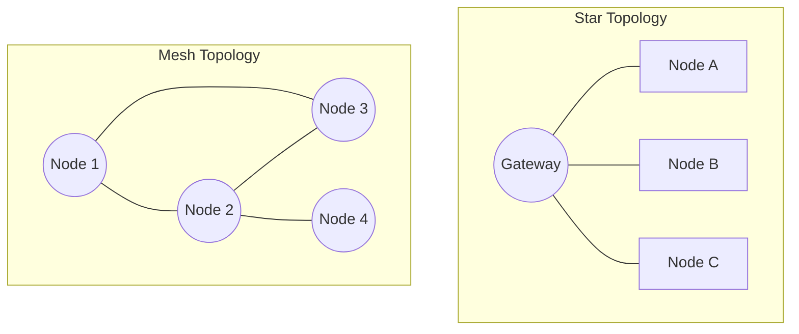

# 📶 Wireless-Architect: Kablosuz Haberleşme ve RF Sistem Rehberi


> "Wireless-Architect, bir IT Mimarının bakış açısıyla kablosuz dünyayı, sadece radyo dalgaları değil, verinin güvenli ve kesintisiz aktığı bir dijital otoyol olarak kurgulayan kapsamlı bir ekosistemdir."

---

## 👨‍💻 Hazırlayan Hakkında
**Bahattin Yunus Çetin** | *IT Architect Candidate*
Trabzon/Of ta ilim talebesi, IT mimarisi ve haberleşme teknolojileri üzerine yoğunlaşmış bir teknoloji tutkunu. TEKNOFEST projelerinde kritik önem taşıyan "Veri İletim Katmanı"nın güvenilirliğini ve performansını optimize etmeye odaklanır.

*   **LinkedIn:** [linkedin.com/in/bahattinyunus](https://www.linkedin.com/in/bahattinyunus/)
*   **GitHub:** [github.com/bahattinyunus](https://github.com/bahattinyunus)

---

## 🏛️ Haberleşme Mimarisi: Wireless Stack Deep-Dive

Kablosuz bir sistem, rastgele dalga yaymak değil; katmanlı bir yapıyı yönetmektir. Wireless-Architect, bu yapıyı 4 ana sütun üzerinde kurar:

### 1. Fiziksel Katman (PHY: Physical Layer)
Sinyalin "hava" üzerindeki formudur.
*   **Modülasyon (Modulation):** Verinin sinüs dalgasına bindirilmesi.
    *   **LoRa (CSS):** Spreading factor (SF) ile gürültü altında dahi (under-the-noise floor) veri alımı.
    *   **OFDM:** Geniş bant uygulamalarında (WiFi/5G) verinin alt taşıyıcılara bölünerek yansımalara karşı direnç kazanması.
*   **SDR (Software Defined Radio):** Donanımsal bağımlılığı minimize eden, sinyali yazılımla işleyen (DSP) üniteler.

### 2. Veri Bağı ve MAC Katmanı (Data Link Layer)
Kimin ne zaman konuştuğunu belirleyen trafik polisidir.
*   **CSMA/CA:** "Dinle ve Konuş" protokolü.
*   **TDMA:** Her cihaza belirli bir zaman dilimi ayrılan, çarpışmasız (collision-free) mimariler.
*   **Acknowledgment (ACK):** Verinin yerine ulaştığının teyit edilmesi.

### 3. Ağ Topolojileri (Network Topologies)
Sistemlerin birbiriyle nasıl bağlandığının haritasıdır.



### 4. Güvenlik ve Dayanıklılık (Security & Resilience)
*   **AES Encryption:** Verinin havada yakalansa dahi okunamaz olması.
*   **FHSS (Frequency Hopping):** Sinyalin sürekli frekans değiştirmesiyle karıştırılmasının (Jamming) zorlaştırılması.

---

## 📡 RF Temelleri ve Link Budget (Altın Kural)

Haberleşme menzilini tahmin etmek bir sanat değil, matematiktir.

| Parametre | Açıklama | Birim |
| :--- | :--- | :--- |
| **Transmit Power** | Vericiden çıkan saf güç. | dBm |
| **Antenna Gain** | Antenin sinyali belirli yöne odaklama gücü. | dBi |
| **Free Space Path Loss** | Mesafe ve frekansa bağlı doğal kayıp. | dB |
| **Sensitivity** | Alıcının duyabileceği minimum sinyal seviyesi. | dBm |

### Link Budget Hesaplayıcı Kullanımı
`scripts/link_budget.py` aracını kullanarak saha testleri öncesi teorik menzil analizi yapabilirsiniz:

```bash
# Örnek: 10km mesafe, 433MHz frekans için analiz
python scripts/link_budget.py --dist 10 --freq 433
```

---

## 🛠️ Donanım ve Entegrasyon Matrisi

| Teknoloji | Menzil | Bant Genişliği | Güç Tüketimi | Kullanım Alanı |
| :--- | :--- | :--- | :--- | :--- |
| **LoRa (SX127x)** | ~15 km | Düşük (<50kbps) | Çok Düşük | Telemetri, Sensör |
| **ESP-Now/WiFi** | ~300 m | Yüksek (Mbps) | Orta | Görüntü, Hızlı Veri |
| **Zigbee** | ~100 m | Orta | Düşük | Ev Otomasyonu, Mesh |

---

## 🛡️ TEKNOFEST Saha Stratejileri (Tactical Advice)

1.  **Gürültü Tabanı (Noise Floor):** Yarışma alanında gürültü ile başa çıkmak için [Gürültü Engelleme Rehberi](docs/interference_mitigation.md) dökümanını inceleyin.
2.  **Fresnel Bölgesi:** Alıcı ile verici arasında sadece "görüş hattı" yetmez. Radyo dalgalarının geçtiği elipsoid alanın (Fresnel Zone) en az %60'ı boş olmalıdır.
3.  **RSSI ve SNR Analizi:** Sinyal kalitesini ölçmek için `scripts/rssi_snr_guide.py` betiğini kullanın.

---

## 📂 Proje Yapısı ve Navigasyon

*   **[configs/](configs/)**: Kritik modül konfigürasyonları. `lora_config.json` ile hızlı setup sağlayın.
*   **[docs/](docs/)**: Teknik referans kütüphanesi. `antenna_guide.md` ve `interference_mitigation.md` gibi temel rehberler.
*   **[scripts/](scripts/)**: Otomasyon araçları. `link_budget.py` ve `rssi_snr_guide.py`.
*   **[.gitignore](.gitignore)** & **[requirements.txt](requirements.txt)**: Standart repo meta dosyaları.
*   **[LICENSE](LICENSE)**: MIT Lisansı.

---

## 🚀 Katkıda Bulunma

Bir IT Architect her zaman yeni fikirlere açıktır. Eğer daha verimli bir modülasyon tekniği veya özel bir MAC protokolü öneriniz varsa:
1.  Projeyi Fork edin.
2.  Özelliğinizi ekleyin.
3.  Pull Request gönderin.

---

© 2025 Bahattin Yunus Çetin. Of, Trabzon.

*Haberleşme sadece bir bağlantı değil, bir mimari eserdir.*
---
---
<p align="center">
  
</p>
