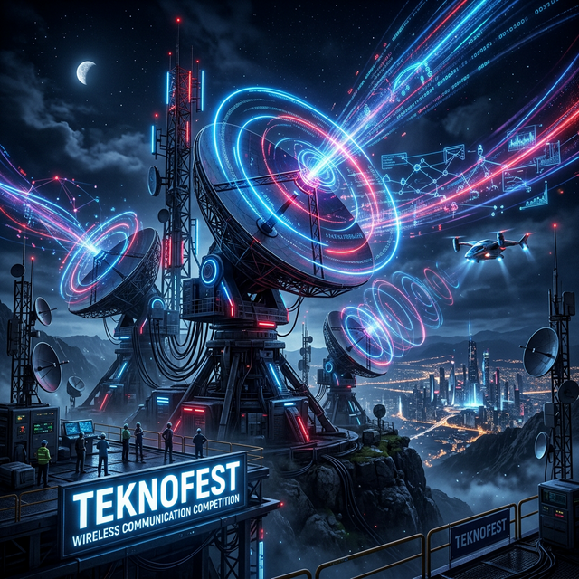
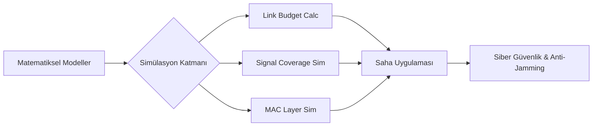
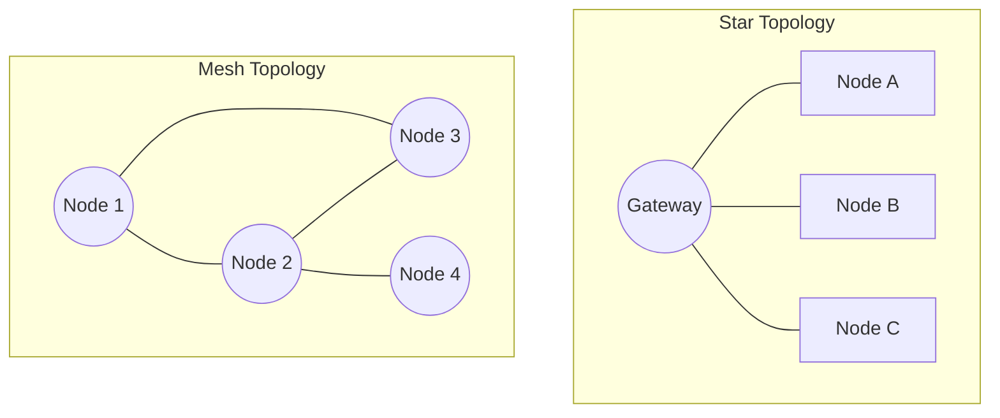

# Wireless-Architect: Kablosuz Haberleşme ve RF Sistem Rehberi


> **Wireless-Architect**, bir İT Mimarı'nın bakış açısıyla kablosuz ağlar, veri linkleri ve kesintisiz iletişim altyapıları üzerine kurgulanan kapsamlı bir ekosistemdir.
> 
> *“Haberleşmeyi sadece bir bağlantı değil, bir mimari eser olarak görüyoruz.”*

---

## 🌌 Vizyon ve Hikaye (Lore & Vision)

Bugünün dünyasında veri, modern savunma ve sivil sistemlerin can damarıdır. Ancak bu damarlar; karıştırma (jamming), gürültü (noise) ve fiziksel engellerle sürekli tehdit altındadır. **Wireless-Architect**, bu tehditlere karşı sadece bir "radyo vericisi" değil, **kendi kendine karar verebilen, spektrumu analiz eden ve en zorlu koşullarda dahi kopmayan dijital otoyollar** inşa etme vizyonuyla doğdu.

TEKNOFEST 2025 sahasına indiğimizde, hedefimiz sadece veri göndermek değil; o veriyi bir mimar titizliğiyle, güvenli ve zeki bir stack üzerinden hedefe ulaştırmaktır.

---

## 🚀 Hazırlayan Hakkında
**Bahattin Yunus Çetin** | *IT Architect Candidate*
İT mimarisi ve haberleşme teknolojileri üzerine yoğunlaşan bir teknoloji tutkunu. TEKNOFEST projelerinde kritik önem taşıyan Veri İletim Katmanı'nın güvenilirliğini ve performansını optimize etmeye odaklanır.

*   **LinkedIn**: [linkedin.com/in/bahattinyunus](https://www.linkedin.com/in/bahattinyunus/)
*   **Github**: [github.com/bahattinyunus](https://github.com/bahattinyunus)

---

## 📡 Haberleşme Mimarisi: Wireless Stack Deep-Dive

Kablosuz bir sistem, rastgele dalga yaymak değil; katmanlı bir yapıyı yönetmektir. Wireless-Architect, bu yapıyı 4 ana sütun üzerinde kurar:

### 1. Fiziksel Katman (PHY: Physical Layer)
Sinyalin "hava" üzerindeki formudur.
*   **Modülasyon (Modulation):** Verinin sinüs dalgasına bindirilmesi.
    *   **LoRa (CSS):** *Spreading Factor (SF)* ile gürültü altında (under-the-noise floor) veri alımı.
    *   **OFDM:** Geniş bant uygulamalarında (WiFi/5G) verinin alt taşıyıcılara bölünerek yansımalara karşı direnç kazanması.
*   **SDR (Software Defined Radio):** Donanımsal bağımlılığı minimize eden, sinyali yazılımla işleyen (DSP) üniteler.

---

## 🏗️ Yazılım Mimarisi (Software Architecture)

Sistemimiz, modüler bir yapıda olup matematiksel modellerden gerçek zamanlı simülasyonlara uzanan geniş bir yelpazeyi kapsar:


```mermaid
graph LR
    A[Matematiksel Modeller] --> B{Simülasyon Katmanı}
    B --> C[Link Budget Calc]
    B --> D[Signal Coverage Sim]
    B --> E[MAC Layer Sim]
    C --> F[Saha Uygulaması]
    D --> F
    E --> F
    F --> G[Siber Güvenlik & Anti-Jamming]
```

---
### 2. Veri Bağı ve MAC Katmanı (Data Link Layer)
Kimin ne zaman konuşacağını belirleyen trafik polisidir.
*   **CSMA/CA:** "Dinle ve Konuş" protokolü.
*   **TDMA:** Her cihaza belirli bir zaman dilimi ayrılan, çarpışmasız (collision-free) mimariler.
*   **Acknowledgement (ACK):** Verinin yerine ulaştığının teyit edilmesi.

### 3. Ağ Topolojileri (Network Topologies)
Sistemlerin birbirine nasıl bağlandığının haritasıdır.


```mermaid
graph TD
    subgraph "Star Topology"
    Gateway((Gateway)) --- NodeA[Node A]
    Gateway --- NodeB[Node B]
    Gateway --- NodeC[Node C]
    end

    subgraph "Mesh Topology"
    M1((Node 1)) --- M2((Node 2))
    M2 --- M3((Node 3))
    M3 --- M1
    M2 --- M4((Node 4))
    end
```

### 4. Güvenlik ve Dayanıklılık (Security & Resilience)
*   **AES Encryption:** Verinin havada yakalansa dahi okunamaması.
*   **FHSS (Frequency Hopping):** Sinyalin sürekli frekans değiştirerek karıştırmasını (Jamming) zorlaştırması.

---

## 🛠 RF Temelleri ve Link Budget (Altın Kural)

Haberleşme menzilini tahmin etmek bir sanat değil, matematiktir.

| Parametre | Açıklama | Birim |
| :--- | :--- | :--- |
| **Transmit Power** | Vericiden çıkan saf güç. | dBm |
| **Antenna Gain** | Antenin sinyali belirli yöne odaklama gücü. | dBi |
| **Free Space Path Loss** | Mesafe ve frekansa bağlı doğal kayıp. | dB |
| **Sensitivity** | Alıcının duyabileceği minimum sinyal seviyesi. | dBm |

### Link Budget Hesaplayıcı Kullanımı
`scripts/link_budget.py` aracını kullanarak sahadaki testleri teorik menzil analizi yapabilirsiniz:

```bash
# Örnek: 10km mesafe, 433MHz frekans için analiz
python scripts/link_budget.py --dist 10 --freq 433 --ptx 14
```

---

## 🧰 Donanım ve Entegrasyon Matrisi

| Teknoloji | Menzil | Bant Genişliği | Güç Tüketimi | Kullanım Alanı |
| :--- | :--- | :--- | :--- | :--- |
| **LoRa (SX127x)** | ~15+ km | Düşük (<50kbps) | Çok Düşük | Telemetri, Sensör |
| **ESP-Now/WiFi** | ~300 m | Yüksek (Mbps) | Orta | Görüntü, Hızlı Veri |
| **Zigbee** | ~100 m | Orta | Düşük | Ev Otomasyonu, Mesh |

---

## ⚔️ TEKNOFEST Saha Stratejileri (Tactical Advice)

1.  **Gürültü Tabanı (Noise Floor):** Yarışma alanında gürültü ile başa çıkmak için [Gürültü Engelleme Rehberi](docs/interference_mitigation.md)ni okuyun.
2.  **Anten Polarizasyonu:** Verici ve Alıcı antenlerin aynı düzlemde (ikisi de dikey veya yatay) olduğundan emin olun.
3.  **Fresnel Bölgesi:** İki anten arasındaki "görüş hattı"nın (LOS) engelsiz olması yetmez, Fresnel bölgesinin %60'ının boş olması gerekir.

---

## 🔍 Rakip Analizi (Competitor & Similar Competitions Analysis)

Kablosuz haberleşme ve RF sistemleri alanında global ve ulusal çapta düzenlenen yarışmaları analiz etmek, yarışmada uygulanabilecek stratejilerde vizyon genişletir. Sadece statik bant genişliği veya basit modülasyonların ötesine geçerek dünyadaki güncel problemleri (jamming mitigation, autonomous spectrum sharing, ML-based beam prediction, O-RAN integrations) anlamak şampiyonluk yolunda kritiktir.

Aşağıda haberleşme ekosistemine yön veren başlıca yarışmalar ve projemize entegre edilebilecek ileri seviye mimariler bulunmaktadır:

### 1. DARPA Spectrum Collaboration Challenge (SC2)
**Kapsam:** Statik spektrum tahsisi algısını yıkan, telsiz ağlarının aynı spektrumu otonom olarak paylaştığı ve birbirlerini engellemeden (Collaborative Intelligent Radio Networks - CIRN) haberleştiği dünyanın en büyük RF şampiyonasıdır. Testler, 128 adet Ettus USRP X310 SDR barındıran devasa "Colosseum" emülatöründe gerçekleştirilmiştir.
**Projeye Katılabilecek Entegrasyon Noktaları (Teknofest Düzeyi):** 
*   **Dynamic Spectrum Sharing (DSS):** Ortamdaki gürültüyü spektrum sensörü (sensing) ile algılayıp, kural-tabanlı veya Q-Learning gibi Reinforcement Learning ajanlarıyla aktif jammer'lardan kaçınan otonom frekans atlamalı (Autonomous FHSS) mimariler geliştirmek.
*   **Frame Error Prediction:** Karşı düğümün hata oranını önceden kestirerek modülasyon tipini (örn: QPSK'den daha düşük veri oranlı BPSK veya CSS'ye) hatasız pakedin ulaşması garanti olana dek dinamik düşürmek.
*   **Açık Kaynak Kod Referansı:** [amahdeej/sc2-frame-error](https://github.com/amahdeej/sc2-frame-error) - RF çakışmalarını tahmin eden nöral ağ eğitim setleri.

### 2. ITU AI/ML in 5G Challenge
**Kapsam:** Uluslararası Telekomünikasyon Birliği (ITU) tarafından desteklenen, 5G sistemleri ve Open RAN (O-RAN) mimarilerinde Makine Öğrenmesi (ML) algoritmalarını yarıştıran global bir platformdur. Özellikle mmWave ortamlarındaki yüksek kayıpların AI destekli beamforming (ışın şekillendirme) ile aşılması hedeflenir.
**Projeye Katılabilecek Entegrasyon Noktaları (Teknofest Düzeyi):**
*   **AI-Assisted Beam Prediction (Işın Kestirimi):** Çok antenli sistemlerde (MIMO) mekanik olarak kör tarama (blind sweep) yapmak yerine; GPS, LiDAR veya geçmiş RSSI verilerini (Multi-modal veri) harmanlayarak bir hedef cihazın anlık konumu için en optimum anten diyagramını/yönünü CNN veya Transformer modellerle saniyeler içinde kestirmek.
*   **xApp Mimarisinin Kopyalanması:** Modellerin karar alma mekanizmasını, vericiye yük bindirmek yerine "near-RT RIC (Real-Time Controller)" mantığıyla yer istasyonunda çalıştırıp radyoya sadece komut yollamak.
*   **Açık Kaynak Kod Referansı:** [ITU-AI-ML-in-5G-Challenge](https://github.com/ITU-AI-ML-in-5G-Challenge) organizasyonundaki 150+ O-RAN odaklı kaynak kod.

### 3. GNU Radio Conference (GRCon) CTF
**Kapsam:** Yazılım Tabanlı Telsiz (SDR) dünyasının en prestijli etkinliklerinden biridir. Capture The Flag (CTF) formatında, sinyal analizi, protokol tersine mühendisliği (reverse engineering) ve sinyal gizleme (steganography) üzerine zorlu problemler içerir.
**Öğrenilecek Noktalar:**
*   **Signal Forensics:** Bilinmeyen bir protokolün (örn: "Not-LoRa") modülasyon tipini, bit hızını ve paket yapısını osiloskop/şelale diyagramı üzerinden analiz ederek çözme becerisi.
*   **DSP Chain Optimization:** GNU Radio bloklarını kullanarak işlemci yükünü minimize eden, gerçek zamanlı (Real-time) yüksek hızlı veri işleme zincirleri kurma.
*   **Açık Kaynak Kod Referansı:** [argilo/grcon24](https://github.com/argilo/grcon24) - GRCon 2024 CTF problemleri ve kaynak kodları.

### 4. TEKNOFEST İçi Diğer Kategoriler ve Çapraz Entegrasyon
*   **Sürü İHA (Swarm UAV):** İHA'ların birbiriyle (Mesh) haberleşmesi, çarpışmadan kaçınma veri linkleri. Özel ağ topolojileri ve ROS2/MAVLink haberleşme uygulamaları en büyük rakiplerin referans kaynağıdır.
*   **Ulaşımda / Havacılıkta Yapay Zeka Düşük Gecikme (Low-Latency) Aktarımları:** GPS kapatıldığında veya jammer açıldığında, FPV/Telemetri kameralarından gelen yüksek çözünürlüklü verinin, sıkıştırma (H265, AI Compression) yardımıyla çok daha kısıtlı ve kirli bir bant üzerinden yer istasyonuna iletilmesi.

---

## 📊 Teknik Kabiliyet Matrisi (Technical Capability Matrix)

Rakiplerle aramızdaki teknolojik farkı ve odak noktalarımızı aşağıdaki matris üzerinden görebiliriz:

| Özellik | DARPA SC2 | ITU 5G | GRCon CTF | Teknofest (Bizim Hedef) |
| :--- | :---: | :---: | :---: | :---: |
| **Yapay Zeka (AI)** | Collaborative RL | Deep Learning (xApp) | Sinyal Forensics | **Hibrit (RL + Sensing)** |
| **Haberleşme Katmanı** | Dinamik Spektrum | mmWave / Beam | SDR / DSP | **Robust PHY / MAC** |
| **Donanım Odağı** | USRP X310 | Open RAN / MIMO | Herhangi bir SDR | **LoRa / SDR / ESP32** |
| **Ana Problem** | Çakışmayı Önlemek | Gecikme / Hız | Sinyali Çözmek | **Menzil / Güvenilirlik** |

---

## 🚀 Stratejik Yol Haritası (Strategic Roadmap)

Analizler sonucunda "Wireless-Architect" projesinin evrileceği vizyon:

1.  **Level 1 (Basic RF):** LoRa/ESP-Now ile temel paket iletimi ve Link Budget hesaplama (Mevcut Durum).
2.  **Level 2 (Resilient COMM):** FHSS (Frekans Atlama) ve Dinamik Paket Boyutu (Adaptive Payload) ile gürültü direnci oluşturma.
3.  **Level 3 (AI-Native PHY):** Sinyal kalitesine göre modülasyonu AI ile tahmin eden ve spektrumu otonom tarayan "Cognitive Radio" katmanı.
4.  **Level 4 (Architect Level):** Çoklu topolojilerin (Star + Mesh) ve hibrit protokollerin tek bir merkezi Mimar (Architect) tarafından yönetildiği kesintisiz eko-sistem.

> **💡 Stratejik Sonuç (Architect's Note):** 
> *Klasik donanım yarışmacıları frekansı değiştirir; şampiyonlar ise frekansın ne zaman tıkanacağını tahmin eder.* Rakipler genellikle sadece SDR veya transreceiver modüllerinin donanımsal yetenekleri üzerinden strateji kurar. Bizim ana hedefimiz; Fiziksel Katmanı (PHY), Yapay Zeka destekli hata düzeltme ve Akıllı Otonom Yönlendirme algoritmalarıyla donatarak bir "Haberleşme Zekası" yaratmaktır.

---

## 📂 Proje Yapısı ve Navigasyon (Project Architecture)

Bu repository, sadece kod değil; bir öğrenme ve uygulama ekosistemidir. Dosyalar aşağıda belirtilen mantıksal düzlemde organize edilmiştir:

### 📖 Teknik Dökümantasyon (`docs/`)
*   **[Mathematical Models](docs/mathematical_models.md)**: Friis, Shannon ve Link Budget'ın teorik temelleri.
*   **[Advanced PHY Layer](docs/advanced_phy_layer.md)**: OFDM, MIMO ve CSS (LoRa) gibi ileri seviye fiziksel katman teknolojileri.
*   **[Cybersecurity Guide](docs/cybersecurity_anti_jamming.md)**: RF sistemlerinde şifreleme, FHSS ve anti-jamming stratejileri.
*   **[Antenna Guide](docs/antenna_guide.md)**: Anten tipleri, kazançları ve polarizasyon stratejileri.

### 🧪 Simülasyon ve Test (`scripts/` & `tests/`)
*   **[Signal Coverage Sim](scripts/signal_coverage_sim.py)**: RF kapsama alanı simülatörü.
*   **[MAC Layer Sim](scripts/mac_layer_sim.py)**: Protokol performans kıyası.
*   **[Unit Tests](tests/test_simulators.py)**: Simülasyon algoritmaları için otomatik testler (`pytest`).
*   **[CI/CD Workflow](.github/workflows/ci.yml)**: GitHub Actions ile her push'ta otomatikleşen test süreci.

### 💼 Girişimcilik ve Strateji (`docs/`)
*   **[Business Strategy](docs/business_strategy.md)**: Projenin Teknofest'ten Startup'a dönüşüm planı.

---

## 🖥️ Terminal Simülasyonu (Tools in Action)

Simülatörlerimizi çalıştırdığınızda aşağıdaki gibi bir çıktı alırsınız:

```text
$ python scripts/signal_coverage_sim.py --size 800 --freq 433
--- Signal Coverage Simulation (800x800 meters) ---
Freq: 433.0 MHz, Ptx: 14.0 dBm, n: 2.5
--------------------------------------------------
🟢 🟢 🟢 🟢 🟢 🟢 🟢 🟢 🟢 
🟢 🟢 🟢 🟢 🟢 🟡 🔴 🔴 🔴 
🟢 🟢 🟡 🟡 🔴 🔴 💀 💀 💀 
🟢 🟡 🔴 🔴 💀 💀 💀 💀 💀 
```

> [!TIP]
> **Hızlı Başlangıç:** `scripts/` klasöründeki araçları `--help` parametresiyle çalıştırarak tüm opsiyonları görebilirsiniz.

---

## 📖 Hızlı Bakış: RF Sözlüğü (Glossary)

| Terim | Tanım | Önem Derecesi |
| :--- | :--- | :---: |
| **RSSI** | Alınan Sinyal Gücü Göstergesi. | ⭐⭐⭐ |
| **SNR** | Sinyal-Gürültü Oranı. LoRa için < 0 olabilir. | ⭐⭐⭐ |
| **DWELL Time** | Bir frekansta kalma süresi (FHSS için kritik). | ⭐⭐ |
| **Multipath** | Sinyalin engellerden yansıyarak farklı yollardan gelmesi. | ⭐⭐ |

---

## 🛠️ Kurulum ve Test (Setup & Testing)

```bash
# Bağımlılıkları yükleyin
pip install -r requirements.txt

# Simülasyon testlerini çalıştırın
pytest tests/
```

---

## 🤝 Katkıda Bulunma

Bu proje açık kaynaklıdır ve katkılara açıktır. Lütfen [CONTRIBUTING.md](CONTRIBUTING.md) dosyasını inceleyin.

---

## © Lisans

MIT License - 2025 Bahattin Yunus Çetin.
